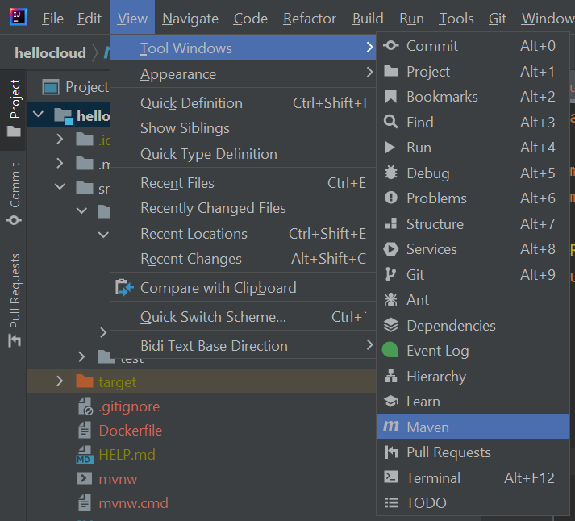
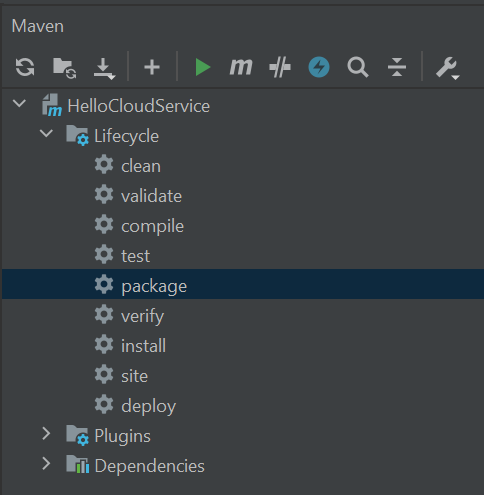

# Create Docker Image

## Introduction

In this activity, we will create a Docker image from a Java application.

## Instructions

1. Open the starter project in IntelliJ.

2. Build and run the project.

3. Open a browser and visit `http://localhost:7979`. The service should return the following:

    ```
    "Hello from minikube!"
    ```

4. Stop the project and open the Maven Projects window in IntelliJ.

    - Click the View menu, then the Tool window, and then Maven.

    

5. Expand the Lifecycle node and double-click the Package node to create a JAR file for the project.

    

6. Add a file named `Dockerfile` to the root of the project.

    - The filename is case sensitive and does not have an extension.

7. Open `Dockerfile`, and enter the following:

   ```
    FROM openjdk:8-jdk-alpine
    ARG JAR_FILE=target/*.jar
    COPY ${JAR_FILE} app.jar
    ENTRYPOINT ["java","-jar","/app.jar"]
   ```

8. Open a terminal, navigate to the folder that contains the Dockerfile, and enter the following command:

    ```
    docker build -t trilogyed/hello-kube-service .
    ```

9. In the terminal, enter the following command:

    ```
    docker images
    ```

10. The `hello-kube-service` should appear in the list.

11. In the terminal, enter the following command:

    ```
    docker run -d -p 7979:7979 --name hello-kube-service trilogyed/hello-kube-service
    ```

12. Open a browser and visit `http://localhost:7979`. The service should return the following:

    ```
    "Hello from minikube!"
    ```

---

© 2022 edX Boot Camps LLC. Confidential and Proprietary. All Rights Reserved.
